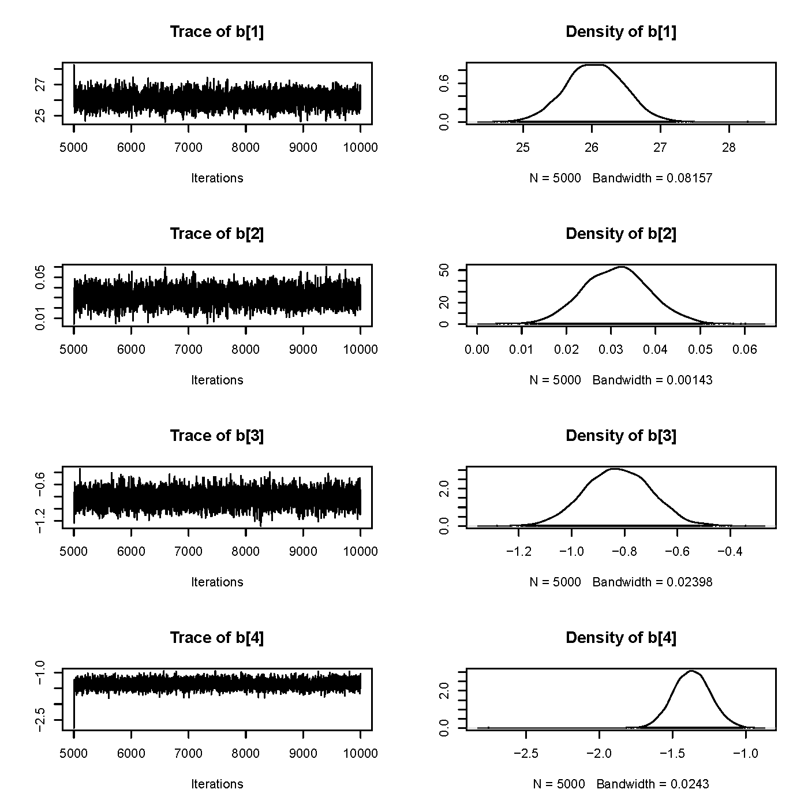
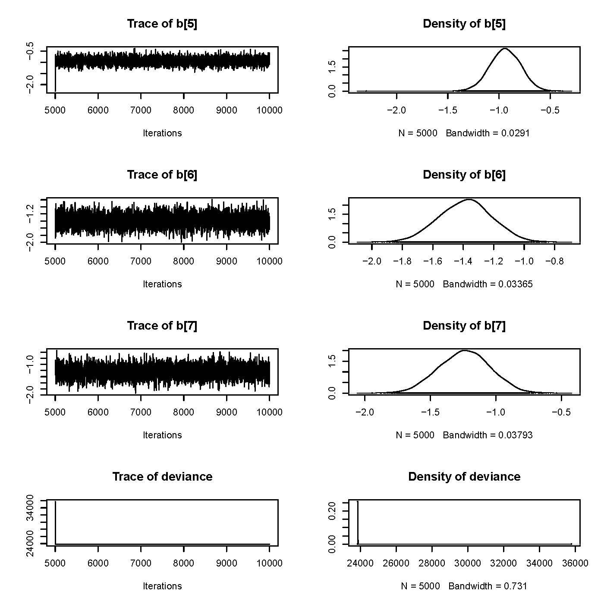
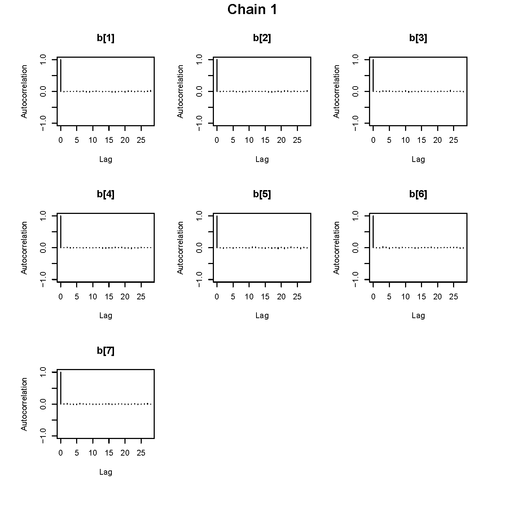

```{r setup, include=FALSE}
library(foreign) 
library(survival) 
library(car)
knitr::opts_chunk$set(include = FALSE, cache = TRUE)
```

```{r load data}
# First, load the data
StephandShelleyDataLoad <- function(filename) 
{
  if(Sys.info()['sysname']=="Darwin"){
    
     load(as.character(filename), envir = globalenv())}
  else{
    windowsfilepath <- paste("~/GitHub/stephandshelley/", filename, sep = "")
     load(as.character(windowsfilepath), envir = globalenv())
  }
}

StephandShelleyDataLoad("CVD_RAP.Rdata")

comp.data$bmi_cat <- relevel(as.factor(comp.data$bmi_cat),2) # NW referent
```

```{r Cox Model-From PB}

# Estimate Cox model:
fit.cox.cvd <- coxph(Surv(timecvd, cvd)~factor(bmi_cat) + age + 
                                        male + factor(educ) + cursmoke,
                                        data=comp.data, ties="efron")
```

```{r RAP-ratio of log-hazard rates for obesity and age- from PB}
# Calculate RAP:
b3 <- coef(fit.cox.cvd)[3] # Obese vs. normal effect 
b4 <- coef(fit.cox.cvd)[4] # Age effect

RAP.OB <- b3/b4 # Point estimate of RAP
```

```{r delta method CI-edited slightly}
# Confidence interval using Delta method:
RAP.OB.CI<- deltaMethod(fit.cox.cvd,"b3/b4", 
                        parameterNames= paste("b", 1:length(coef(fit.cox.cvd)), sep=""))

RAP.OB.CI.EstandCI <- round(RAP.OB.CI$Estimate + RAP.OB.CI$SE*c(0,-1.96,1.96),2)
```

```{r bootstrap-edited slightly}
# # Confidence interval via Bootstrapping:
# N.sims <- 5000 # Number of simulations (resamples) PB sets to 5000
# 
# RAP.OB.BOOT <- rep(NA,N.sims)
# 
# set.seed(8765432)
# 
# for (i in 1:N.sims) {
# # Randomly sample the dataset with replacement
# data.tmp <- comp.data[sample(1:dim(comp.data)[1], replace=TRUE),]
# 
#   # Estimate Cox model on the resampled data:
# fit.cox.cvd.boot <- coxph(Surv(timecvd, cvd)~factor(bmi_cat) + age + male + 
#                             factor(educ) + cursmoke,
#                        data=data.tmp, ties="efron")
# 
#   # Accumulate estimates of RAP
# RAP.OB.BOOT[i] <- coef(fit.cox.cvd.boot)[3]/coef(fit.cox.cvd.boot)[4]
# print(i) #steph added this so we know where the bootstrap is at
# }
# 


# #Steph wrote so we don't have to re-run the bootstrap every time
# BootstrapResults <- as.data.frame(RAP.OB.BOOT)
# save(BootstrapResults, file = "BootstrapResults.Rdata")

StephandShelleyDataLoad("BootstrapResults.Rdata")
RAP.OB.BOOT <- as.vector(BootstrapResults$RAP.OB.BOOT)

# 95% quantile-based Bootstrapped confidence intervals for RAP
round(quantile(RAP.OB.BOOT, c(0.025, 0.975)),2)
mean(RAP.OB.BOOT)
median(RAP.OB.BOOT) # Probably better if distribution is skewed

# Plot the kernel density to inspect the distribution:
pdf("RAP Density.pdf")
plot(density(RAP.OB.BOOT), main="Empirical density of RAP for Obesity")
dev.off()
```

```{r Bayesian Linear Regression Model-from PB}
library(R2jags) 
library(coda) 
library(lmtest) 
library(foreign) 
library(survival)

 StephandShelleyDataLoad("frmgham_recoded.Rdata")
 
 #For now, we assume a vague prior with zero mean and variance 1000
 
 # JAGS code for the posterior distribution:
bmi.model <- function() { 
  for (i in 1:N) {
mu.bmi[i] <- b[1] + b[2]*age[i] + b[3]*female[i] + 
             b[4]*cursmoke[i] + b[5]*educ2[i] + b[6]*educ3[i] + b[7]*educ4[i];
bmi[i] ~ dnorm(mu.bmi[i],tau.bmi); # Sampling distribution
}
tau.bmi ~ dgamma(a.tau, b.tau); # Precision

se.bmi <- 1/sqrt(tau.bmi);  # Standard error of residuals

#PRIORS ON BETAS
b[1:Nx] ~ dmnorm(mu.b[1:Nx],tau.b[1:Nx,1:Nx]) # multivariate normal prior 
}

# Extract data elements from data frame
bmi <- frmgham_recoded$bmi
age <- frmgham_recoded$age
female <- as.integer(frmgham_recoded$sex==2) 
cursmoke <- frmgham_recoded$cursmoke

# Create education indicators (a shortcut using the model.matrix command)
educ1 <- model.matrix(~ -1 + factor(educ), data=frmgham_recoded)[,1] 
educ2 <- model.matrix(~ -1 + factor(educ), data=frmgham_recoded)[,2] 
educ3 <- model.matrix(~ -1 + factor(educ), data=frmgham_recoded)[,3] 
educ4 <- model.matrix(~ -1 + factor(educ), data=frmgham_recoded)[,4]

# Constants to be passed in
N <- length(bmi); # Num. obs.
Nx <- 7; # Num. of reg. params. (w/ intercept)

# Parameters on the priors:
a.tau <- .001; b.tau <- .001;   # Parameters for prior on tau.bmi
mu.b <- rep(0,Nx);    # Prior mean of beta
tau.b <- diag(.001,Nx);  # Prior precision


# Lists for JAGS
bmi.data <- list("N","Nx","bmi","age","female","cursmoke","educ2",
                 "educ3","educ4","mu.b","tau.b","a.tau","b.tau")

bmi.parameters <- c("b","tau.bmi", "se.bmi") # Parameters to keep track of
 
# bmi.inits <- function() {list (b=rep(0,Nx))}
bmi.inits <- list(list(b=rep(0,Nx)), 
                  list(b=rep(-1,Nx)),
                  list(b=rep(1,Nx)))

bmi.sim <- jags(data=bmi.data,inits=bmi.inits, 
                parameters.to.save=bmi.parameters,
              n.iter=10000, model.file=bmi.model,
              n.thin=1, jags.seed=110410)
bmi.sim.output <- print(bmi.sim,digits=4)

```

```{r Assessing Convergence-from PB}
bmi.mcmc <- as.mcmc(bmi.sim)

# Traceplot and density plots for regression coefficients 
# code will save to PDF in current directory.
# Execute "plot" commands only to plot to screen.
pdf("Traceplot_LinearReg.pdf")    # Write what comes next to PDF file
plot(bmi.mcmc[1][,1:4])           # For beta1-4
plot(bmi.mcmc[1][,5:8])           # For beta5-6 and deviance
dev.off()                         # Stop writing to the PDF file

   
# Autocorrelation plots for the regression coefficients
pdf("ACF_LinearReg.pdf") 
par(omi=c(.25,.25,.25,.25))         # Create an outer margin (room for title)
autocorr.plot(bmi.mcmc[1][,1:7])    # For chain 1
title("Chain 1", outer=T)           # Place title in outer margin of page

autocorr.plot(bmi.mcmc[2][,1:7])    # For chain 2 (optional)
title("Chain 2", outer=T)

autocorr.plot(bmi.mcmc[3][,1:7])    # For chain 3 (optional)
title("Chain 3", outer=T) 
dev.off()

geweke.diag(bmi.mcmc[,1:7])         # Geweke test

```

```{r Informative prior 1-from PB}
#Change the prior on the smoking variable to reflect that you expect the mean of the corresponding slope to be +100 (current smokers have a BMI 100 kg/m2 greater than non-smokers [yes, this is nonsensical]), while leaving the means on the other slope parameters equal to zero and all prior variances=1000; call this model “Informative Prior 1.”

# Informative prior 1 (Change prior mean to 1000 for beta[4])
mu.b[4] <- 100
bmi.sim.inform1 <- jags(data=bmi.data,inits=bmi.inits, 
                        parameters.to.save=bmi.parameters,
                         n.iter=10000, model.file=bmi.model,
                         n.thin=1, jags.seed=110410)
                          print(bmi.sim.inform1,digits=4)
```

```{r Informative prior 2-from PB}
tau.b[4,4] <- 1/0.1225 # Gets evaluated when "jags" function is called

bmi.sim.inform2 <- jags(data=bmi.data,inits=bmi.inits, parameters.to.save=bmi.parameters,
                         n.iter=10000, model.file=bmi.model,
                         n.thin=1, jags.seed=110410)

print(bmi.sim.inform2,digits=4)
```


# Bootstrap confidence interval for RAP

\vspace{10pt}

## 1. Write out the statistical model that you fit to calculate the RAP in terms of the parameters (e.g. $\beta$-coefficients). What is the expression for the RAP in terms of the model parameters? (15 points)
  
\vspace{10pt}
The model that we fit was a cox proportional hazards model for time to incident CVD as a function of BMI, age, sex, education and current smoking status. BMI and education were each categorized into 4 categories (with appropriate indicators.)

\vspace{4mm}

\[
\begin{array}{cc}
log[h(t|\boldsymbol{x})] & = log[h_0(t)] + BMI_{underweight} \times \beta_1 + BMI_{overweight} \times \beta_2 + BMI_{obese} \times \beta_3 + \\
& age \times \beta_4 + sex \times \beta_5 +  highschool \times \beta_6 +\\ 
&  some college \times \beta_7 + morethancollege \times \beta_8 + current smoking \times \beta _9
\end{array}
\]

\vspace{6mm}

The RAP (rate advancement period) of how much obesity increases the risk of CVD with age is the ratio of the log hazard ratio of obesity on CVD, divided by the log hazard ratio of age on CVD. Thus,

\vspace{4mm}

\[
\begin{array}{cc}
RAP_{\text{obesity by age}} = \frac{log HR_{\text{obesity}}}{log HR_{\text{age}}} = \frac{\beta_{\text{obesity}}}{\beta_{\text{age}}} = \frac{\beta_3}{\beta_4}
\end{array}
\]

\vspace{6mm}

## 2. What is the value for the RAP for the obese vs. normal weight exposure level and its 95\% CI from the delta method? Offer an interpretation of this effect measure. (15 points)

\vspace{10pt}

Based on the delta method analysis, the RAP for obese vs. normal weight participants is `r RAP.OB.CI.EstandCI[1]` (`r RAP.OB.CI.EstandCI[2]`,  `r RAP.OB.CI.EstandCI[3]`). This implies that for a one year increase in age, the hazard of CVD based on obesity increases by `r RAP.OB.CI.EstandCI[1]`. If we were to take many samples of participants from the same underlying population, and calculate a 95\% confidence interval from each sample using these methods, 95\% of those confidence intervals should contain the true population value for the RAP. (`r RAP.OB.CI.EstandCI[2]`, `r RAP.OB.CI.EstandCI[3]`) is one such interval.

## 3. What is the bootstrapped mean and 95\% confidence interval estimate for the RAP for the obesity effect? How does this bootstrapped estimate of the 95\% confidence interval compare to the estimate from the delta method (remembering that they are both approximations!)? Turn in the density plot for the bootstrapped RAP. (10 points)

\vspace{20pt}

Based on our bootstrap, the RAP is estimated to be `r round(mean(RAP.OB.BOOT),2)` (`r round(quantile(RAP.OB.BOOT, c(0.025, 0.975)),2)[1]`, `r round(quantile(RAP.OB.BOOT, c(0.025, 0.975)),2)[2]`). This estimate is very similar to the estimate from the delta method. See density plot for the bootstrapped RAP below.
  
```{r include = TRUE, echo = FALSE, out.width = '65%'}
plot(density(RAP.OB.BOOT), main="Empirical density of RAP for Obesity")
```

# Linear regression model of BMI

\vspace{2pt}

## 4. Using the R code provided, complete Table 1. (20 points)

\fontfamily{cmr}\selectfont{Table 1. Posterior means and 95\% credible intervals for slope coefficient from linear regression model of BMI on age, sex, and education level.}

| Variable | Vague Prior | Informative Prior 1* | Informative Prior $2^\dagger{}$ |--
| ---------------------- | -------------------------------- | ---------------------------------- | -------------------------------- |
__Age__   (per year increase)          |  0.0312      (0.0171, 0.0456) | 1.1370 (0.9733, 1.2988) | 0.0331 (0.0189, 0.0476) |
__Female sex__ (vs. male)           | -0.8222      (-1.0674, -0.5762) | 18.2504 (15.4178, 21.0927) | -0.7914 (-1.0313, -0.5516) |
__HS education__ (vs. $<$HS) | -0.9377 (-1.2327, -0.6462) | -3.5712 (-7.0184, -0.1744) | -0.9419 (-1.2382, -0.6472) |
__Some college__ (vs. $<$HS)          | -1.3889 (-1.7360, -1.0393) | 0.2782 (-3.8106, 4.3455) | -1.3863 (-1.7367, -1.0407) |
__College+__ (vs. $<$HS)              | -1.2422 (-1.6439, -0.8368) | 2.0072 (-2.5946, 6.7131) | -1.2368 (-1.6326, -0.8398) |
__Curr. smoker__ (vs. non)        | -1.3662 (-1.6161, -1.1167) | 94.5712 (93.8629, 95.2786)| -1.2113 (-1.4426, -0.9772) |
*Prior mean for effect of current smoking = 100, prior variance = 1000  
$\dagger$Prior mean for effect of current smoking = 100, prior variance = 0.1225

\vspace{10pt}

## 5. What seems to be more influential, varying the prior mean, or the prior variance? In one sentence, briefly explain what you think is happening? (10 points)

Varying the prior variance was considerably more influential than varying the prior mean. Because the prior and the maximum likelihood from the current data are weighted based on the certainty (i.e. variance in the data), when the variance of the prior is very small it has strong influence, and when the variance is very large it is overwhelmed by the shape of the data itself.


\vspace{10pt}

## 6. Using the trace plots, density plots and autocorrelation plots (focus on 1st chain) from the diagnostics for the first model ("Vague prior"), briefly describe any evidence of convergence (or lack of convergence) that you see. Attach these plots (2 pages for trace/density plots; 1 page for autocorrelation plots). (20 points)

According to the trace plots, density plots, and 1st chain autocorrelation plots, there is strong evidence of convergence. The trace plots show "fuzzy caterpillars" that are straight and essentially display noise along a horizontal line. The density plots look fairly normally distributed, with only minor bumps and distortions (i.e. like with $\beta_2$); nothing concerning. The autocorrelation plots drop nearly to zero starting with k = 1, which is also a sign that the thinning was sufficient. (*See the following pages for the plots referenced in this answer.*)

\vspace{10pt}

## 7. From the results of the Geweke test, is there evidence for lack of convergence? Justify your answer. (10 points)

The largest test statistic (in absolute number) from the Geweke test is -1.82775 in the 1st chain, 1.8920 in the second chain, and -1.41083 in the 3rd chain. Since none of those test statistics are $>$1.96 (the threshold for non-convergence), we can feel pretty comfortable we have reached convergence (noting that the test statistics do come fairly close to the threshold).


\pagebreak

```{r include = TRUE, echo = FALSE, out.width = '100%'}

```

```{r include = TRUE, echo = FALSE, out.width = '100%'}

```

```{r include = TRUE, echo = FALSE, out.width = '100%'}

```
