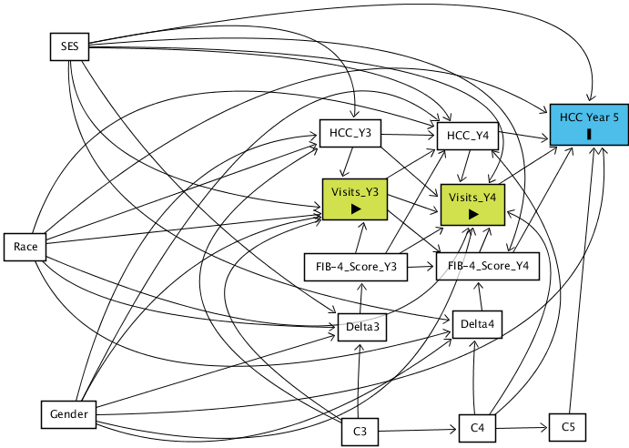

```{r setup, include=FALSE}
library(tidyverse)
library(readxl)
library(skimr)
library(knitr)

knitr::opts_chunk$set(include = FALSE, cache = TRUE)

HCVData <- read_excel("Deidentified Chronic HCV Dataset 9-10-19 (1).xlsx")

```

```{r Data Cleaning}
#Let's do all Variable prep/Data cleaning in this chunk

#first just making variables their proper type, and renaming so there's no spaces
HCVData$`Deidentified Pt Numb`<- as.factor(HCVData$`Deidentified Pt Numb`)
colnames(HCVData)[colnames(HCVData) == 'Deidentified Pt Numb'] <- 'PtID'

HCVData$`Hep Visit`<- as.factor(HCVData$`Hep Visit`)
colnames(HCVData)[colnames(HCVData) == 'Hep Visit'] <- 'EverHepVisit'

HCVData$`Ever Chronic HCV` <- as.factor(HCVData$`Ever Chronic HCV`)
colnames(HCVData)[colnames(HCVData) == 'Ever Chronic HCV'] <- 'EverChronicHCV'

HCVData$`Spontaneous Clearance?` <- as.factor(HCVData$`Spontaneous Clearance?`)
colnames(HCVData)[colnames(HCVData) == 'Spontaneous Clearance?'] <- 'SpontClearance'

HCVData$`Ever Ab positive HCV` <- as.factor(HCVData$`Ever Ab positive HCV`)
colnames(HCVData)[colnames(HCVData) == 'Ever Ab positive HCV'] <- 'EverAbPosHCV'

HCVData$`Ever Treated`<- as.factor(HCVData$`Ever Treated`)
colnames(HCVData)[colnames(HCVData) == 'Ever Treated'] <- 'EverTreated'


HCVData$`SVR Achieved`<- as.factor(HCVData$`SVR Achieved`)
colnames(HCVData)[colnames(HCVData) == 'SVR Achieved'] <- 'SVRAchieved'


HCVData$`Treatment Definition` <- as.factor(HCVData$`Treatment Definition`)
colnames(HCVData)[colnames(HCVData) == 'Treatment Definition'] <- 'TreatmentDefinition'


HCVData$`DX_TYPE OR TEST_TYPE-Reason for inclusion` <- as.factor(HCVData$`DX_TYPE OR TEST_TYPE-Reason for inclusion`)
colnames(HCVData)[colnames(HCVData) == 'DX_TYPE OR TEST_TYPE-Reason for inclusion'] <- 'inclusion.source'

HCVData$`DX_NAME OR TEST RESULT-Reason for inclusion`<- as.factor(HCVData$`DX_NAME OR TEST RESULT-Reason for inclusion`)
colnames(HCVData)[colnames(HCVData) == 'DX_NAME OR TEST RESULT-Reason for inclusion'] <- 'inclusion.reason'

#Didn't do anything with the column 'ICD10 OR RESULT_DATE' because it's a mix of formats/info

colnames(HCVData)[colnames(HCVData) == 'SPECIMN TAKEN DATE of first positive'] <- 'date.first.pos.HCV.test'

HCVData$RESULT <- as.factor(HCVData$RESULT)
colnames(HCVData)[colnames(HCVData) == 'RESULT'] <- 'HCV.test.result'

HCVData$'RNA EVER TESTED' <- as.factor(HCVData$'RNA EVER TESTED')
colnames(HCVData)[colnames(HCVData) == 'RNA EVER TESTED'] <- 'RNAeverTested'

colnames(HCVData)[colnames(HCVData) == 'FIRST POS (Or if no POS, "SEE TEXT") RNA TEST DATE'] <- 'Date.First.Pos.RNA'

HCVData$'FIRST POS (Or if no POS, "SEE TEXT") RNA TEST RESULT' <- as.factor(HCVData$'FIRST POS (Or if no POS, "SEE TEXT") RNA TEST RESULT')
colnames(HCVData)[colnames(HCVData) == 'FIRST POS (Or if no POS, "SEE TEXT") RNA TEST RESULT'] <- 'Result.First.Pos.RNA'

colnames(HCVData)[colnames(HCVData) == 'MOST RECENT RNA POS'] <- 'Most.Recent.RNA.Pos'

colnames(HCVData)[colnames(HCVData) == 'MOST RECENT RNA NEG'] <- 'Most.Recent.RNA.Neg'

#This column is in the midst of the RNA testing section but is unlabeled. It's a date.
colnames(HCVData)[colnames(HCVData) == '...19'] <- 'UnknownColumn'

colnames(HCVData)[colnames(HCVData) == 'MOST RECENT RNA "SEE TEXT"'] <- 'Most.Recent.RNA.SeeText'

colnames(HCVData)[colnames(HCVData) == 'RNA interpretation'] <- 'RNA.interpretation'

colnames(HCVData)[colnames(HCVData) == 'other notes on diagnosis'] <- 'Notes'

HCVData$'Where getting care' <- as.factor(HCVData$'Where getting care')
colnames(HCVData)[colnames(HCVData) == 'Where getting care'] <- 'Care.Location'

#This errors because there are a number of non-dates in this column. Should discuss with Rena if using.
#HCVData$'HEP C GENOTYPE DATE' <- as.POSIXct(HCVData$'HEP C GENOTYPE DATE')
#colnames(HCVData)[colnames(HCVData) == 'HEP C GENOTYPE DATE'] <- 'HCV.Genotype.Date'

HCVData$'HEP C GENOTYPE RESULT' <- as.factor(HCVData$'HEP C GENOTYPE RESULT')
colnames(HCVData)[colnames(HCVData) == 'HEP C GENOTYPE RESULT'] <- 'HCV.Genotype.Result'

HCVData$'Ever Had a Primary Care Visit' <- as.factor(HCVData$'Ever Had a Primary Care Visit')
colnames(HCVData)[colnames(HCVData) == 'Ever Had a Primary Care Visit'] <- 'EverPrimaryCareVisit'

HCVData$'DEPT_NAME' <- as.factor(HCVData$'DEPT_NAME')

HCVData$'CURRENT_PCP' <- as.factor(HCVData$'CURRENT_PCP')

HCVData$'CURRENT_PCP_DEPT' <- as.factor(HCVData$'CURRENT_PCP_DEPT')

HCVData$'ORD_VALUE' <- as.factor(HCVData$'ORD_VALUE')
colnames(HCVData)[colnames(HCVData) == 'ORD_VALUE'] <- 'HIV.Result'

HCVData$'HepA_IgG' <- as.factor(HCVData$'HepA_IgG')

HCVData$'HBsAg_Value' <- as.factor(HCVData$'HBsAg_Value')

HCVData$'Med_1' <- as.factor(HCVData$'Med_1')

HCVData$'Med_2' <- as.factor(HCVData$'Med_2')

HCVData$'HEPB_CORE_IgM_RESULT' <- as.factor(HCVData$'HEPB_CORE_IgM_RESULT')

HCVData$'HEPB_CORE_Total_RESULT' <- as.factor(HCVData$'HEPB_CORE_Total_RESULT')

HCVData$DX_TYPE <- as.factor(HCVData$DX_TYPE)
colnames(HCVData)[colnames(HCVData) == 'DX_TYPE'] <- 'Cancer.Diagnosis.Source'

HCVData$DX_NAME <- as.factor(HCVData$DX_NAME)
colnames(HCVData)[colnames(HCVData) == 'DX_NAME'] <- 'Cancer.Diagnosis.Name'

HCVData$ICD10 <- as.factor(HCVData$ICD10)
colnames(HCVData)[colnames(HCVData) == 'ICD10'] <- 'Cancer.ICD10'
```

```{r Code For the DAG}
#DAGGity code- ie to use in the online Daggity tool...I don't love rDaggity
#But am putting the code here so we have it. Reminder that you can command/control-shift-c to comment in or out a whole chunk.

# C3 1 @-0.048,2.046
# C4 1 @0.719,2.020
# C5 1 @1.311,2.011
# Delta3 1 @-0.030,1.162
# Delta4 1 @0.719,1.135
# FIB-4_Score_Y3 1 @-0.072,0.653
# FIB-4_Score_Y4 1 @0.790,0.644
# Gender 1 @-1.945,1.903
# HCC%20Year%205 O @1.449,-0.615
# HCC_Y3 1 @-0.108,-0.481
# HCC_Y4 1 @0.659,-0.463
# Race 1 @-2.228,0.483
# SES 1 @-1.939,-1.213
# Visits_Y3 E @-0.078,0.019
# Visits_Y4 E @0.689,0.064
# 
# C3 C4 Delta3 @-0.066,1.743 HCC_Y3 @-1.933,0.848 Visits_Y3 @-1.616,0.729
# C4 C5 Delta4 @0.683,1.671 HCC_Y4 @1.700,0.966 Visits_Y4 @1.533,0.510
# C5 HCC%20Year%205
# Delta3 FIB-4_Score_Y3
# Delta4 FIB-4_Score_Y4
# FIB-4_Score_Y3 FIB-4_Score_Y4 HCC_Y4 Visits_Y3 Visits_Y4
# FIB-4_Score_Y4 HCC%20Year%205 Visits_Y4
# Gender Delta3 Delta4 @-0.730,2.493 HCC%20Year%205 @1.694,1.823 HCC_Y3 @-1.467,-0.374 HCC_Y4 @-0.545,-1.642 Visits_Y3 @-1.311,0.421 Visits_Y4 @0.270,2.609
# HCC_Y3 HCC_Y4 Visits_Y3 Visits_Y4
# HCC_Y4 HCC%20Year%205 Visits_Y4
# Race Delta3 @-1.740,1.126 Delta4 @-1.687,2.003 HCC%20Year%205 @-0.188,-1.761 HCC_Y3 HCC_Y4 @-1.734,-1.440 Visits_Y3 Visits_Y4 @0.240,1.841
# SES Delta3 @-1.275,0.153 Delta4 @-1.999,0.600 FIB-4_Score_Y4 @1.569,-1.615 HCC%20Year%205 @1.676,-2.097 HCC_Y3 @-0.012,-1.731 HCC_Y4 @0.317,-1.195 Visits_Y3 @-1.910,-0.061 Visits_Y4 @1.389,-1.213
# Visits_Y3 FIB-4_Score_Y4 HCC_Y4 Visits_Y4
# Visits_Y4 HCC%20Year%205
```
## Description of our Dataset

We have access to a dataset of chronic Hepatitis C patients currently receiving care in the UCSF system. There are `r nrow(HCVData)` patients, who are seen in a variety of primary care clinics and the hepatology (liver) clinic. These data come from a query of Apex, the UCSF-specific build of the electronic medical record system Epic. 
We have a preliminary dataset resulting from the intial Apex query and will be getting access to more data soon. This initial report has been completed with our intended causal question, describing the data that we currently have and indicating where we are waiting for more data.

### Defining Our Variables

-**Exposures**: We will have data on the annual number of clinical visits that each chronic HCV patient had in the UCSF system over the last five years.

-**Outcome**: The outcome will be diagnosis of hepatocellular carcinoma (HCC), which occured in `r nrow(HCVData)- as.numeric(summary(HCVData$Cancer.Diagnosis.Source)["NA's"])` patients. We do not currently have the dates of the HCC diagnoses for all patients, however, for the subset that had biopsies (n =`r nrow(HCVData)- as.numeric(summary(is.na(HCVData$BIOPSY_DATE))["TRUE"])`) `r round((as.numeric(summary(HCVData$BIOPSY_DATE < as.POSIXct(strptime("2015-01-01", "%Y-%m-%d")))["FALSE"])/(nrow(HCVData)- as.numeric(summary(is.na(HCVData$BIOPSY_DATE))["TRUE"])))*100,2)`% of them occured after 01/01/2015 suggesting that the large majority of the hepatocellular carcinoma diagnoses occured in the last 5 years. 

-**Covariates**: Annual FIB-4 score (a validated measure used for prediction of cirrhosis, which uses age, platelet count and liver transaminases), gender, race, insurance type (mediCal vs private- a surrogate of socioeconomic status.)


### Our DAG
```{r DAG, include = TRUE, echo = FALSE, out.width= "65%"}

```

We intend to do this analysis using 5 years worth of data, but in order to simplify the DAG, we present only the final 3 years (two of exposure data and a final year of outcome) here. This DAG includes both a delta variable indicating whether or not our covariate was measured and a C value at each time point indicating whether or not the patient has been censored from the dataset. 


### Our Structural Causal Model
-Using those relationships drawn in the previous step, define your structural equations generically; in other words, don't assuming distributions or functional forms yet. Do you have any prior knowledge on the functional forms?


### Exploring Our Data
-Make histograms for continuous variables and tables for binary/categorical variables.
-What shapes do the distributions seem to take? Based on the shape, what known distribution do you think that variable's error term is drawn from?

-If you've picked a distribution for an exogenous variable, how would you parameterize it?

### Missingness
  There will be some patients that do not have a FIB-4 score in a given year because they did not have a laboratory assessment of their platelets or transaminases. There is not missingness in the exposure-since EMRs are designed for clinical billing, the data on whether or not visit(s) occured are expected to be highly accurate. Because HCC is a common and severe complication of HCV, we are comfortable assuming that a patient who is still followed in the system, and does not yet have a diagnosis of HCC, is truly negative fo HCC, rather than simply missing that data.

Patients can be censored from the dataset in one of two ways: either by no longer seeking care within the UCSF system, or if they are deceased.

-Based on \textit{a priori} knowledge, do you expect missingness to depend on other variables? Which ones?

### Simulation
-Come up with more specific structural equations that relate the endogenous variables based on the previous two questions.

-Create a function to simulate your data and generate $n = 1000$ copies of your $O$.

-Check the histograms and summary statistics of the variables in your simulated data and see how they match up to your real data. Over the course of the class you can refine your data generating structure to match the data at hand. 


## Proposed Causal Question
-Inclusion criteria

-Outcome

-Intervention Nodes

-Counterfactual outcomes of interest

-Target Causal parameter


### Defining your Causal Question}
-What is the Causal Question (or questions) of interest for your dataset?

-What is the ideal experiment that would answer your Causal Question?

-Which of your variables variables would you intervene on to answer your Causal Question(s)? What values would you set them equal to?

-What outcomes are you interested in? Measured when?

-Target parameter and counterfactual outcomes

-What are your counterfactual outcomes, and how would you explain them in words?

-Come up with a target parameter that would answer your Causal Question.

-What aspects of the counterfactual outcome distribution are you interested in contrasting?

-What contrast are you interested in (e.g., absolute difference? relative difference? MSMs? conditional on subgroups?)?

### Intervention on SCM
-How would you intervene on the SCM you came up with to evaluate the causal target parameter?

-Implement this intervention computationally.

-Evaluate $\Psi^F(P_{U,X})$

-Using simulations, generate many counterfactual outcomes.

-Evaluate $\Psi^F(P_{U,X})$.

-Write a sentence interpreting your $\Psi^F(P_{U,X})$.


##Identification and Estimand
1.  Under what assumptions is the target causal parameter you came up with in the previous lab identified as afunction of the observed data distribution?

2.  What is your $\psi(P_0)$, the statistical estimand?

3.  Optional:  confirm that in your simulation, the value of your estimand equals the value of your target causalparameter.

##Preliminary Feasibility assessment

